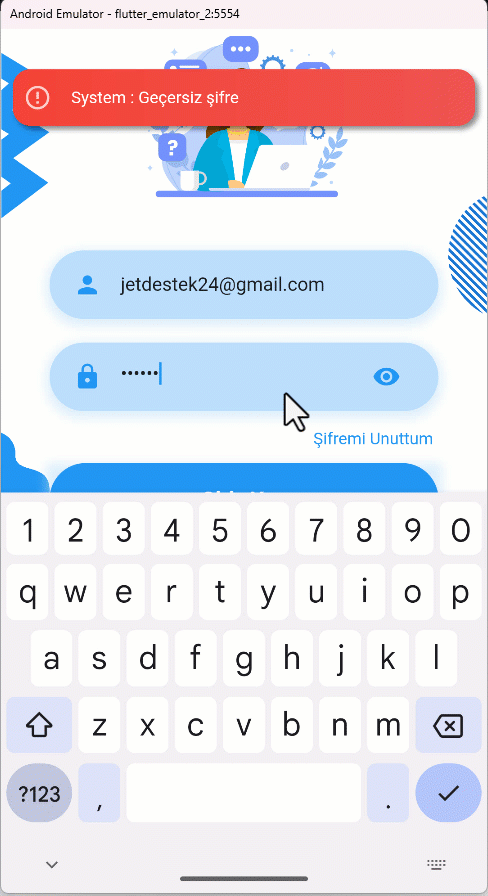
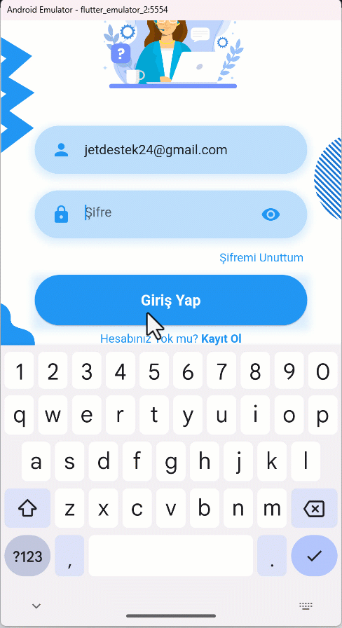
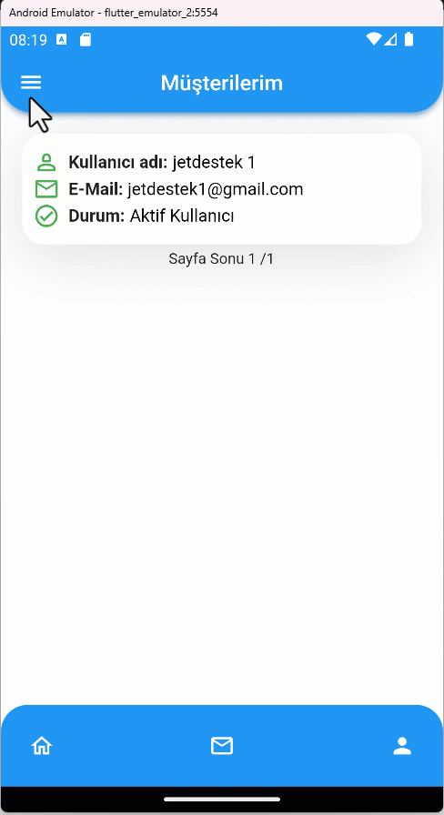
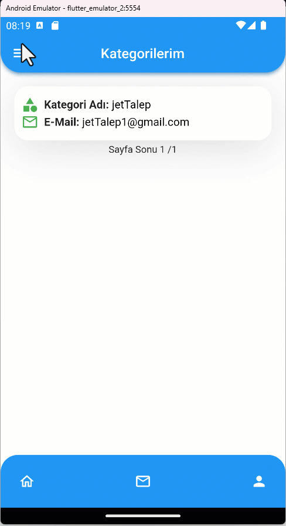
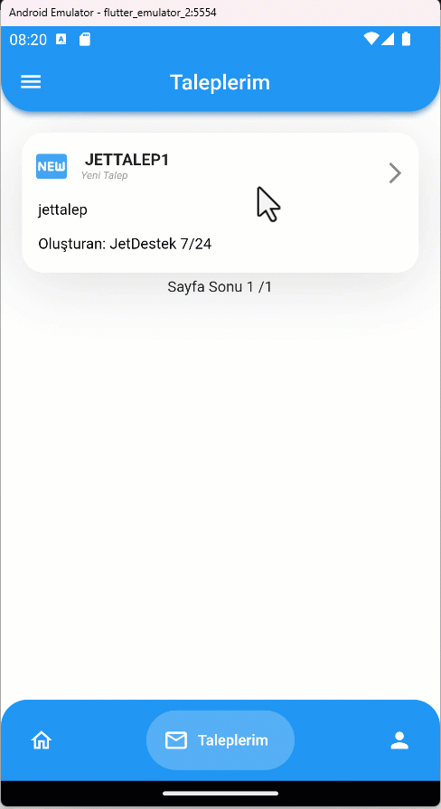
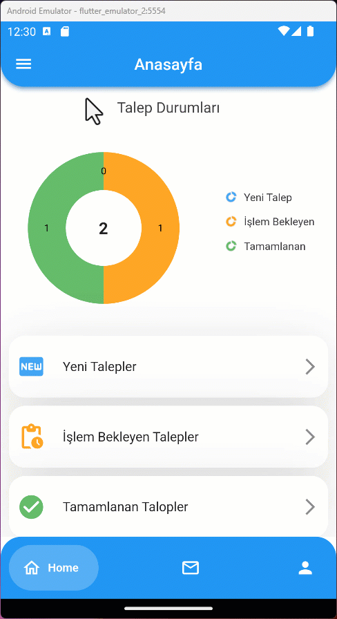
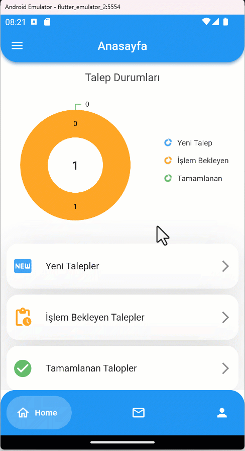
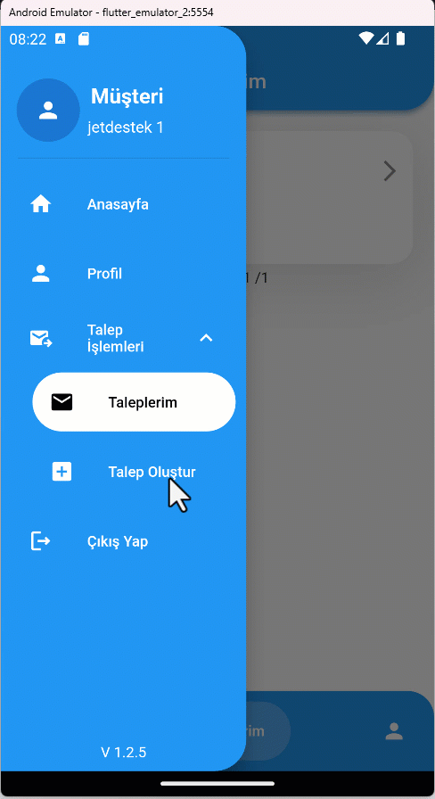
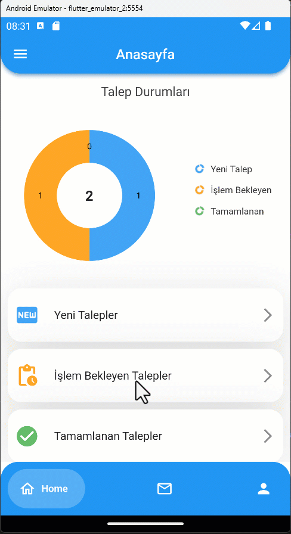
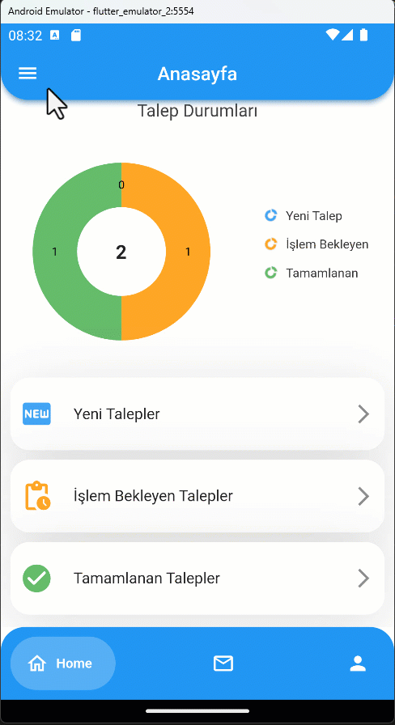

# 📲 Ticket App

Bu uygulama bir destek talep uygulamasıdır. Bu uygulama üzerinden bir şirket hesabı açtıktan sonra şirket kendi kullanıcılarını oluşturup o kullanıcıların sorunlarına cevap verebilir ve onlara destek sağlayabilir.

## Kullanılan Teknolojiler

 </a>  <a href="https://flutter.dev" target="_blank" rel="noreferrer"> 
  

## 📖 Uygulamanın Kullanımı
 
   ### 📋 Hesap Oluşturma
 
 Kayıt ol sayfasından oluşturduğumuz hesap bir client yani şirket hesabıdır, şirket hesabını açtıktan sonra hesaba giriş yapıp müşterilerimizi oluşturabileceğiz şuan ilk adım olarak şirket hesabımızı oluşturalım.
 

  
 
   ### 📧 Şifre Sıfırlama
 
 Hesabımızın şifresini unuttuğumuzda mail adresimizi kullanarak şifremizi sıfırlayabiliriz.
 
  

   ### 🔑 Giriş Yapma
 
 Uygulamaya Giriş Yapalım.

  

 
   ### ✏️ Profil Düzenleme
 
 Navigasyon Barının en sağ tarafında profil ekranı bulunmakta bu ekranda profilimizi düzenleyip şifremizi değiştirebiliriz.
 
  

   ### ➕ Müşteri Oluşturma
 
 Şirketimize taleplerini iletecek kişiler için müşteri hesabı oluşturmamız gerekiyor, sidebar'da müşteri işlemleri alanından müşteri oluştur seçeneği ile müşterilerimizi oluşturabiliriz.
 
  

   ### 🏷️ Kategori Oluşturma
 
 Oluşturulacak talepleri kategorize edebilmemiz için yeni kategori alanları oluşturmalıyız bu işlemi de sidebar'da kategori işlemleri alanından kategori oluştur seçeneği ile kategorilerimizi oluşturabiliriz.
 
  
 
   ### 📬 Talep Oluşturma
 
 Şirket hesabıyla talep oluştracaksak eğer bir müşteri adına oluşturabiliriz bu örnekte yeni oluşturduğumuz müşterimizin adına bir talep oluşturuyoruz.

  
      
   ### 🔧 Talep İşlemleri
 
  Burada artık taleplerimizi yönetebiliriz, taleplere yanıt verebilir onları farklı bir kategoriye yönlendirebilir ve talebimizi sonlandırabiliriz.
 
  
 
   ### 📁➕ Dosyalı Talep Oluşturma
 
 Taleplerimize Dosya ekleyebiliriz
 
  
 
   ### 📂⬇️ Dosyalı Talepten Dosya İndirm
 
 Taleplerimizden dosyalarımızı indirebiliriz.
 
  
 
   ### 🚪🔑 Şirket Hesabından Çıkış Yapma ve Müşteri Hesabına Giriş Yapma
 
 Şimdi şirket hesabımızla oluşturduğumuz müşteri hesabımıza girme vakti

  
 
   ### 💬 Müşteri Hesabından Talebe Yanıt Verme
 
 Müşterilerimiz taleplere nasıl yanıt veriyor bir de ona bakalım.

  
 
   ### ➕ Müşteri Hesabından Talep Oluşturma
 
 Müşterilerimiz talep işlemleri menüsünden yeni bir talep oluşturabilir bu talepler sadece oluşturan müşteri ve şirket hesabı tarafından görünmektedir.

  
 
   ### ✅ Şirket Hesabından Talep Kapatma
 
 Müşterilerimiz talepleri tamamlandıktan sonra taleplerini kapatıp işlemleri sonlandırabiliriz.
  
 
   ### 📚 Şirket Hesabı Sol Menü
 
 Şirket Hesabında sol taraftaki tüm menüler.
 
  
 
